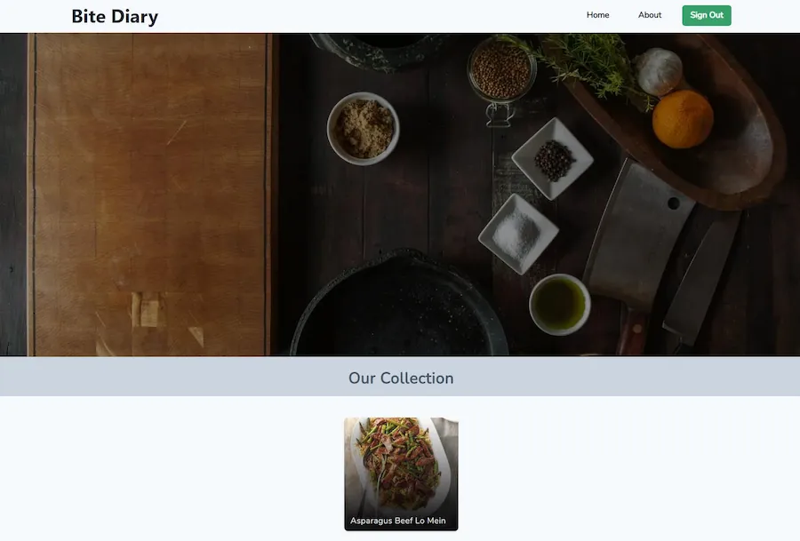

# Bite Diary

A recipe diary designed to record family and friend recipes, mostly family delicacies. Recipes may be created, updated, and deleted from the app.

## Overview

## Project Status

Editing a recipe and the pagination for the main recipe page are currently in progress.

## Links

- [Github Repo](https://github.com/PomPoko-lab/bite-diary 'Bite Diary Repo')

- [Live](https://www.pompoko.io 'Live View')

## Features

- Account Log in
- View and search recipe postings
- Update and remove a recipe
- Browse for recipes
- Create a recipe using an API. -- Not yet implemented.

## Screenshots

### Website Homepage

## Planned Updates

- [ ] Searching for a recipe
- [ ] Main page pagination
- [ ] Recipe submission through an API

## Built with

- ReactJS
- ChakraUI
- React Router
- Firebase
- NPM

## Purpose of this project

I wanted a quick and simple way to preserve my family's recipes. I tend to forget the recipes and losing track of where I recorded them. Now I'll always have a spot to go back to when I need to refer to them.

## Experiences gained from this project

- Optimizing lighthouse performance by implementing compression utilities
- Additional React Router concepts
- Firebase interactions as a BaaS.
- Auth, Firestore, CRUD, and Storage
- Firebase hosting
- Firebase rules
- Custom subdomain URL routing
- Advanced CSS practice utilizing Chakra UI
- Advanced CSS practice utilizing Chakra UI
- CSS img srcset enabling responsive images and image performance optimizations
- CSS loading image properties
- Implementing a customized scrollbar
- Mobile first design
- Utilizing the React Context API (user auth)
- Form validation with error throwing

## Contact

- [Github Profile](https://github.com/PomPoko-lab 'PomPoko-lab')
- [Email](mailto:hello@pompoko.io 'My Email')
- [Portfolio/Website](https://pompoko.io/ 'Portfolio')

## License

Copyright &copy; 2022, CraftyBi.

## Acknowledgments

- [Design inspiration](https://www.behance.net/gallery/35747197/Resipi%28New-Recipe-website%29 'Resipi inspiration')
- [Design inspiration](https://www.behance.net/gallery/106014453/Aroma-Recipe-Web-App 'Aroma inspiration')

## Support

Please give a ⭐️ if you like this project!
